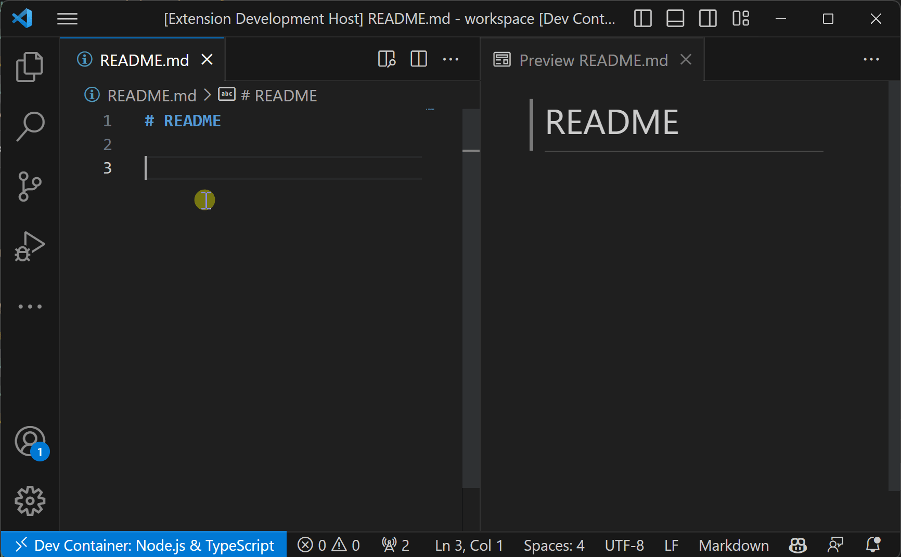

# Markdown Image Paste for Remote

Markdown Image Paste for Remote is a Visual Studio Code extension designed to simplify the process of inserting images into Markdown files while working in a remote development environment, such as GitHub Codespaces or a DevContainer. It uses the WebView clipboard API to provide an easy and convenient way to copy images from your clipboard to your remote host and automatically generate the appropriate Markdown syntax for the copied image.

## Features

- Utilizes WebView clipboard API to copy images from the clipboard to the remote host
- Users can click a button within the WebView to access the clipboard content
- Automatically generate Markdown syntax for the copied image
- When a text is selected in the editor, the extension uses the selected text as the default file name in the input box. The selected text will be replaced by the generated syntax.

## Motivation

While several existing extensions support copying images from the local clipboard into Markdown files, they typically do not work seamlessly with remote development environments like GitHub Codespaces or DevContainers. Visual Studio Code's API does provide access to the local clipboard; however, [it only supports text content, not images](https://code.visualstudio.com/api/advanced-topics/remote-extensions#using-the-clipboard).

As a workaround, I implemented a solution that leverages the WebView clipboard API to enable access to the local clipboard and support copying image content. This approach allows users to conveniently copy images from their local clipboard to the remote host while working in a remote development environment.

## How it works

The extension uses the WebView clipboard API to access the local clipboard and copy image content. 
It works by following these steps:

- User copies an image to the clipboard
- User run the `Insert Image` command
- The extension creates a WebView panel and show paste button
- User clicks the paste button to grant access to the clipboard (interactive action required by the WebView clipboard API)
- WebView encodes the image content as a base64 string and sends it to the extension
- The extension decodes the base64 string and saves the image to remote host
- The extension generates the appropriate Markdown syntax for the copied image and inserts it into the Markdown file

## Extension Settings

- markdownImagePasteForRemote.imagePath
    The destination to save image file.

    You can use variable:

    ${currentFileDir}: the path of directory that contain current editing file.
    ${projectRoot}: the path of the project opened in vscode.
    ${currentFileName}: the current file name with ext.
    ${currentFileNameWithoutExt}: the current file name without ext.

    Default value is ${currentFileDir}${currentFileNameWithoutExt}.

## Contribution

This extension is created for personal use. But any contribution is welcome. Feel free to open an issue or submit a pull request.

## Release Notes

### 0.1.0

- Improved the file name input validation to restrict the use of forbidden characters, including /, \, :, *, ?, ", <, >, |. This prevents potential issues with the file system or operating system
- When a text is selected in the editor, the extension now uses the selected text as the default file name in the input box. The selected text will be replaced by the generated syntax.

### 0.0.4

Initial release.

## License

MIT
